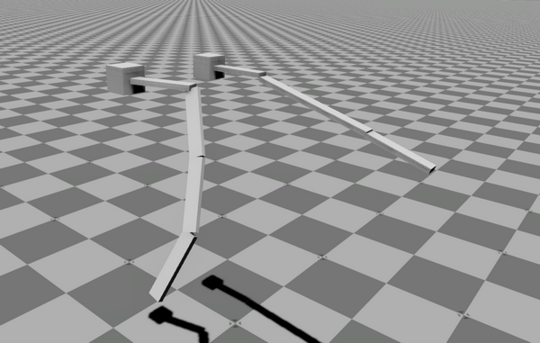
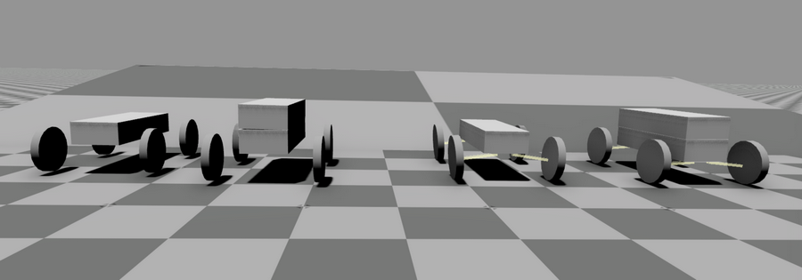
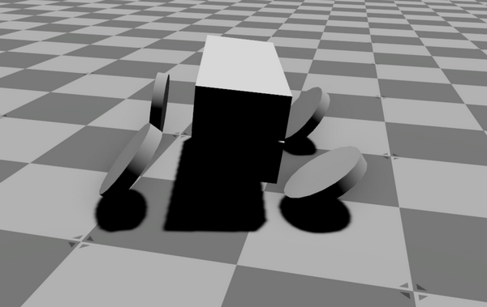
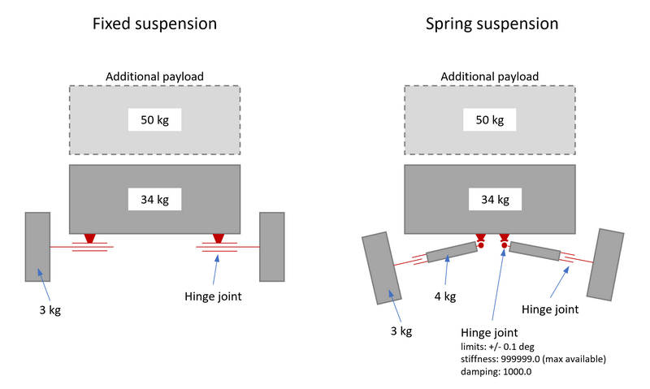

# o3de-physics-test-scene

***Testing physics in Open 3D Engine***

Project created with O3DE ver. 2205, Windows.

Project consists of 2 levels:
- robot_arm_test1
- mobile_robot1

## Robot Artm Test

### Description

This is a simulation of a simple robot arm. It consists of 4 segments connected to a static base. 
Total length of the arm is around 1m, each segment weights 1.0kg, which makes it realistic. No additional load is applied. The first case tests fixed joints – no rotation is allowed. The second case tests hinge joint, which should allow rotation in horizontal plane only. In both cases joints do not prevent rotations in “fixed” directions. 

### Simulation setup

All arms:
-	1 root rigid body, fixed – set to kinematic
-	4 movable rigid bodies:
    -	mass: 1.0 kg
    -	other rigid body parameters: default
    -	collision shape length: 0.25 m
-	all 5 bodies connected using joints
-	joint location: the end of the collision shape
-	collision: PhysX Shape Collider with Box Shape

Join types in arms:
1.	Fixed Joint
2.	Hinge Joint:
    -	allowed rotation around vertical (Z) axis
    -	no limits defined
    -	not breakable

## Mobile Robot

### Description

This is a simulation of a mobile robot, with main dimensions and masses roughly based on [Hunter SE Mobile Robot](https://www.generationrobots.com/en/403917-robot-mobile-hunter-se-ugv.html). Maximum payload for this robot is 50 kg. Robot was created in 2 versions: with fixed suspension and with “spring” suspension. Robot descends the ramp with an incline of 10 degrees, with and without the 50 kg payload. 

**Notice 1:**

Wheels are quite heavy (3 kg), which is ok, since they have hub motors. However, adding lighter wheels makes the simulation less stable.

**Notice 2:**

In the “spring suspension” version, the swingarm is heavy as well (4 kg, which is more than the wheel). If its mass is reduced to i.e. 1 kg, it’s not able to hold the robot. 

### Simulation setup

Robot body:
-	Mass: 34kg
-	Shape: 0.3x0.82x0.15 m
-	PhysX Collider with shape: box

Each wheel:
-	Mass: 3.0 kg
-	Radius: 0.15 m
-	Width: 0.05 m
-	Hinge joint, no limits, not breakable

Swingarm (in the “spring suspension”):
-	Mass: 4.0 kg
-	Hinge joint with body:
    -	Limits: +/- 0.1 deg
    -	Stiffness: 999999.0 (max available)
    -	Damping: 1000.0

