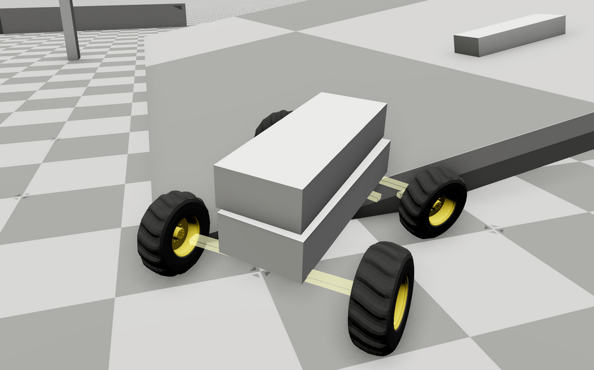
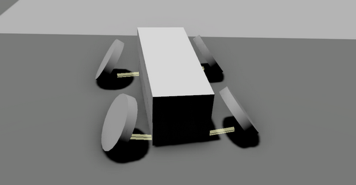

# O3DE Physics tests

***Testing physics in Open 3D Engine***

The purpose of this project is to test the O3DE physics capabilities in the context of robotic simulations. Two main aspects are considered: robot chassis with wheel suspension (mobility) and a manipulator arm.

## Requirements 

This project requires the [O3DE development branch](https://github.com/o3de/o3de/tree/development). It was created on Windows with O3DE build with the date 2022.08.11 and commit #e57b0df5d661867f6. In principle, it should work with newer versions. It should also work on Linux (not yet tested in its current form).

## Running the demo

1. Follow O3DE documentation to [Download](https://www.o3de.org/docs/welcome-guide/setup/setup-from-github/) and [Build](https://www.o3de.org/docs/welcome-guide/setup/setup-from-github/building-windows/) O3DE. Use the [O3DE development branch](https://github.com/o3de/o3de/tree/development).
1. Clone physics test repository `git clone https://github.com/RobotecAI/o3de-physics-test-scene`

Building the project using project manager on Windows:

1. Open O3DE project manager, select `Open Existing Project` (from the `New Project...` pull-down menu), and select o3de-physics-test-scene.
1. From the "hamburger menu" of the newly added project select `Edit Project Settings...` and select engine and hit `Save`.
1. `Build Project`
1. `Open Editor`
1. Load level

To build the project using the CLI interface on Windows or Linux follow [these instructions](https://docs.o3de.org/docs/welcome-guide/create/creating-projects-using-cli/). Before building the project on Linux register it with: `$O3DE_DIR_PATH/scripts/o3de.sh register -pp $PROJECT_DIR_PATH`.

## Contents

The project consists of the following levels:
- [mobile_robot_physics](#mobile_robot_physics)
- [robot_arm_test1](#robot_arm_test1)
- [robot_arm_test2](#robot_arm_test2)
- [mobile_robot1](#mobile_robot1)

Description in following sections.

## Mobile Robot Physics

Level: **mobile_robot_physics**

The goal of this level is to test vehicle physics that can be applied to mobile robot. The scene contains a simple 4-wheels vehicle, with a spring-based suspension, which can be controlled using the keyboard. The vehicle can carry a payload, to test physics in different load conditions.

### Instructions

- Use keyboard arrows to control the vehicle (speed and steering).
- Press `Enter` to drop the payload.
- Use `WSAD` and mouse to move the camera around the vehicle.
- To disable the payload (entity: `payload`), either set its rigid body to Kinematic or move it to the side.

### Details

#### Vehicle construction

Suspension of the vehicle was created using rigid body swing arms connected to the chassis with hinge joints. These joints have applied stiffness and dumping to hold the vehicle. Front wheels are additionally equipped with steering knuckles, connected by hinge joints to arms. These joints have stiffness and damping as well, to force the wheel to rotate to the neutral position.

#### Steering

Steering is done by a script `mobile_robot_control.lua`. Wheels rotation as, well as steering knuckles rotations, are done by using `ApplyAngularImpulse`.

#### Tuning of physics

To eliminate problems with physics described in the following sections, the following changes to the default configuration were done:
- Global physics configuration: 
    - `Max Time Stape: 0.01`
    - `Fixed Time STape: 0.001`
- Solver iterations for the chassis (entity `mobile_robot`): `Position: 10`, `Velocity: 4`

These parameters were set experimentally, and most probably may be further tuned. 

### TODO

- Speed control. Implement a controller to maintain the desired speed, instead of just applying momentum, as it is done right now
- Correct steering. Implement controller to maintain the desired steering angle

| Next experiments were done to test the stability of physics |
|---|

## Robot Arm Test

### Description

Level: **robot_arm_test1**

This is a simulation of a simple robot arm. It consists of 4 segments connected to a static base. 
The total length of the arm is around 1m, each segment weighs 1.0kg, which makes it realistic. No additional load is applied. The first case tests fixed joints – no rotation is allowed. The second case tests the hinge joint, which should allow rotation in the horizontal plane only. In both cases, joints do not prevent rotations in “fixed” directions. 

### Simulation setup

All arms:
-	1 root rigid body, fixed – set to kinematic
-	4 movable rigid bodies:
    -	mass: 1.0 kg
    -	other rigid body parameters: default
    -	collision shape length: 0.25 m
-	all 5 bodies connected using joints
-	joint location: the end of the collision shape
-	collision: PhysX Shape Collider with Box Shape

Join types in arms:
1.	Fixed Joint
2.	Hinge Joint:
    -	allowed rotation around the vertical (Z) axis
    -	no limits defined
    -	not breakable

## Testing Solver Iterations

Level: **robot_arm_test2**

### Description
The development version of O3DE includes “Solver Iterations” settings in the Rigid Body pane. Changing these settings affects problems described in previous sections and possibly can be used to tune physics simulation. The behavior of these settings is however strange: this is a local parameter, set on the rigid body level. However, changing it even in a single rigid body affects the whole simulation.

### Simulation setup

The same as in **robot_arm_test1**. The only difference is, that both arms were rotated a bit to demonstrate hinge joints rotation and the hinge joints arm was given contact between segments.

## Mobile Robot stability test

### Description

This is a simulation of a mobile robot, with main dimensions and masses roughly based on [Hunter SE Mobile Robot](https://www.generationrobots.com/en/403917-robot-mobile-hunter-se-ugv.html). The maximum payload for this robot is 50 kg. The robot was created in 2 versions: with fixed suspension and with “spring” suspension. The robot descends the ramp with an incline of 10 degrees, with and without the 50 kg payload. 

**Notice 1:**

The wheels are quite heavy (3 kg), which is ok since they have hub motors. However, adding lighter wheels makes the simulation less stable.

**Notice 2:**

In the “spring suspension” version, the swingarm is heavy as well (4 kg, which is more than the wheel). If its mass is reduced to i.e. 1 kg, it’s not able to hold the robot. 

### Simulation setup

Robot body:
-	Mass: 34kg
-	Shape: 0.3x0.82x0.15 m
-	PhysX Collider with shape: box

Each wheel:
-	Mass: 3.0 kg
-	Radius: 0.15 m
-	Width: 0.05 m
-	Hinge joint, no limits, not breakable

Swingarm (in the “spring suspension”):
-	Mass: 4.0 kg
-	Hinge joint with body:
    -	Limits: +/- 0.1 deg
    -	Stiffness: 999999.0 (max available)
    -	Damping: 1000.0

